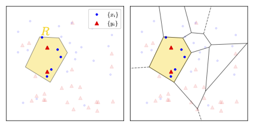

# PQMass: Probabilistic Assessment of the Quality of Generative Models using Probability Mass Estimation


[](https://github.com/Ciela-Institute/PQM/actions/workflows/ci.yml)
[](https://github.com/psf/black)

[](https://codecov.io/gh/Ciela-Institute/PQM)
[](https://arxiv.org/abs/2402.04355)

[PQMass](https://arxiv.org/abs/2402.04355) is a new sample-based method for evaluating the quality of generative models as well as assessing distribution shifts to determine if two datasets come from the same underlying distribution.

## Install

To install PQMass, run the following:

```bash
pip install pqm
```

## Usage

PQMass takes in $x$ and $y$ two datasets and determines if they come from the same underlying distribution. For instance, in the case of generative models, $x$ represents the samples generated by your model, while $y$ corresponds to the real data or test set.


PQMass partitions the space by taking reference points from $x$ and $y$ and creating Voronoi tessellations around the reference points. On the left is an example of one such region, which we note follows a Binomial Distribution; the samples are either inside or outside the region. On the right is the entire space partitioned, allowing us to see that this is a multinomial distribution, a given sample can be in region P or any other region. This is crucial as it allows for two metrics to be defined that can be used to determine if $x$ and $y$ come from the same underlying distribution. The first is the $\chi_{PQM}^2$

$$\chi_{PQM}^2 \equiv \sum_{i = 1}^{n_R} \left[ \frac{(k({\bf x}, R_i) - \hat{N}_{x, i})^2}{\hat{N}_{x, i}} + \frac{(k({\bf y}, R_i) - \hat{N}_{y, i})^2}{\hat{N}_{y, i}} \right]$$

and the second is the $\text{p-value}(\chi_{PQM}^2)$

$$\text{p-value}(\chi_{PQM}^2) \equiv \int_{-\infty}^{\chi^2_{\rm {PQM}}} \chi^2_{n_R - 1}(z) dz$$

For $\chi_{PQM}^2$ metric, given your two sets of samples, if they come from the same
distribution, the histogram of your $\chi_{PQM}^2$ values should follow the  $\chi^2$
distribution. The degrees of freedom (DoF) will equal `DoF = num_refs - 1` The
peak of this distribution will be at `DoF - 2`, the mean will equal `DoF`, and
the standard deviation will be `sqrt(2 * DoF)`. If your $\chi_{PQM}^2$ values are too
high (`chi^2 / DoF > 1`), it suggests that the samples are out of distribution.
Conversely, if the values are too low (`chi^2 / DoF < 1`), it indicates
potential duplication of samples between `x` and `y`.

If your two samples are drawn from the same distribution, then the $\text{p-value}(\chi_{PQM}^2)$
should be drawn from the random $\mathcal{U}(0,1)$ distribution. This means that if
you get a very small value (i.e., 1e-6), then you have failed the null
hypothesis test, and the two samples are not drawn from the same distribution.
If you get values approximately equal to 1 every time then that suggests
potential duplication of samples between `x` and `y`.

PQMass can work for any two datasets as it measures the distribution shift between the $x$ and $y$, which we show below.

## Example

We are using 100 regions. Thus, the DoF is 99, our expected $\chi^2$ peak of the distribution is 97, the mean is 99, and the standard deviation should be 14.07. With this in mind, we set up our example. For the p-value, we expect to be between 0 and 1 and a significantly small p-value (e.g., $< 0.05$ or $< 0.01$) would mean we reject the null hypothesis and thus $x$ and $y$ do not come from the same distribution.

Our expected p-value should be around 0.5 to pass the null hypothesis test; any significant deviation away from this would indicate failure of the null hypothesis test.

Given two distributions, $x$ and $y$, sampling from a $\mathcal{N}(0, 1)$ in 10 dimensions, the goal is to determine if they come from the same underlying distribution. This is considered the null test as we know they come from the same distribution, but we show how one would use PQMass to determine this.

```python
from pqm import pqm_pvalue, pqm_chi2
import numpy as np

p = np.random.normal(size = (500, 10))
q = np.random.normal(size = (400, 10))

# To get chi^2 from PQMass
chi2_stat = pqm_chi2(p, q, re_tessellation = 1000)
print(np.mean(chi2_stat), np.std(chi2_stat)) # 98.51, 11.334

# To get pvalues from PQMass
pvalues = pqm_pvalue(p, q, re_tessellation = 1000)
print(np.mean(pvalues), np.std(pvalues)) # 0.50, 0.26
```

We see that both $\chi_{PQM}^2$ and $\text{p-value}(\chi_{PQM}^2)$ follow the expected $\chi^2$ indicatiing that both $x$ and $y$ come from the same underlying distribution.

Another such example in which we do $\textit{not}$ expect $x$ and $y$ to come from the same distribution is if $x$ is again sampled from a $\mathcal{N}(0, 1)$ in 10 dimensions whereas $y$ is sampled from a $\mathcal{U}(0, 1)$ in 10 dimensions.

```python
from pqm import pqm_pvalue, pqm_chi2
import numpy as np

p = np.random.normal(size = (500, 10))
q = np.random.uniform(size = (400, 10))

# To get chi^2 from PQMass
chi2_stat = pqm_chi2(p, q, re_tessellation = 1000)
print(np.mean(chi2_stat), np.std(chi2_stat)) # 577.29, 25.74

# To get pvalues from PQMass
pvalues = pqm_pvalue(p, q, re_tessellation = 1000)
print(np.mean(pvalues), np.std(pvalues)) # 3.53e-56, 8.436e-55
```

Here it is clear that both $\chi_{PQM}^2$ and $\text{p-value}(\chi_{PQM}^2)$ are not close to their expected results, thus showing that $x$ and $y$ do $\textbf{not}$ come from the same underlying distribution.

Thus, PQMass can be used to identify if any two distributions come from the same underlying distributions if enough samples are given. We encourage users to look through the paper to see the varying experiments and use cases for PQMass!

## How to Intrept Result

We have shown what to expect for PQMass when working with $\chi_{PQM}^2$ or $\text{p-value}(\chi_{PQM}^2)$ however when working with $\chi_{PQM}^2$, there is the case in which it will return 0's. There are a couple reasons in why this could happen

- For Generative Models; 0's indicate memorization. Samples are duplicates of the data it has been trained on.
- For non generative model scenario, it is typically due to lack of samples espically in high dimensions. Increasing samples should alleviate the issue.
- Another scenario in which one could get 0's in a non generative model case is that it can also be an inidcator of duplicate samples in $x$ and $y$.

## Advanced Usage

Depending on the data you are working with we show other uses of the parameters for PQMass.

### Z-Score Normalization

If you determine that you need to normalize $x$ and $y$, there is a z-score normalization function built into PQMass, and one can call it by setting `z_score_norm = True`:

```python
chi2_stat = pqm_chi2(p, q, re_tessellation = 1000, z_score_norm = True)
pvalues = pqm_pvalue(p, q, re_tessellation = 1000, z_score_norm = True)
```

### Modification to how references points are selected

The default setup for selecting reference points is to take the number of regions and then sample from $x$ and $y$ proportional to each length, respectively. However, if, for your case, you want to only sample the reference points from $x$ by setting `x_frac = 1.0`:

```python
chi2_stat = pqm_chi2(p, q, re_tessellation = 1000, x_frac = 1.0)
pvalues = pqm_pvalue(p, q, re_tessellation = 1000, x_frac = 1.0)
```

Alternatively, you can sample the reference points only from $y$ by setting `x_frac = 0`:

```python
chi2_stat = pqm_chi2(p, q, re_tessellation = 1000, x_frac = 0)
pvalues = pqm_pvalue(p, q, re_tessellation = 1000, x_frac = 0)
```

Similary you can sample reference points equally from both $x$ and $y$ by setting `x_frac = 0.5`:

```python
chi2_stat = pqm_chi2(p, q, re_tessellation = 1000, x_frac = 0.5)
pvalues = pqm_pvalue(p, q, re_tessellation = 1000, x_frac = 0.5)
```

Lastly one could not sample reference points from either $x$ or $y$ but instead sample from a Guassian by using the `guass_frac = 1.0`:

```python
chi2_stat = pqm_chi2(p, q, re_tessellation = 1000, guass_frac = 1.0)
pvalues = pqm_pvalue(p, q, re_tessellation = 1000, guass_frac = 1.0)
```

### GPU Compatibility

PQMass now works on both CPU and GPU. All that is needed is to pass what device you are on via `device = 'cuda'` or `device = 'cpu'`

## Developing

If you're a developer then:

```python
git clone git@github.com:Ciela-Institute/PQM.git
cd PQM
git checkout -b my-new-branch
pip install -e .
```

But make an issue first so we can discuss implementation ideas.
